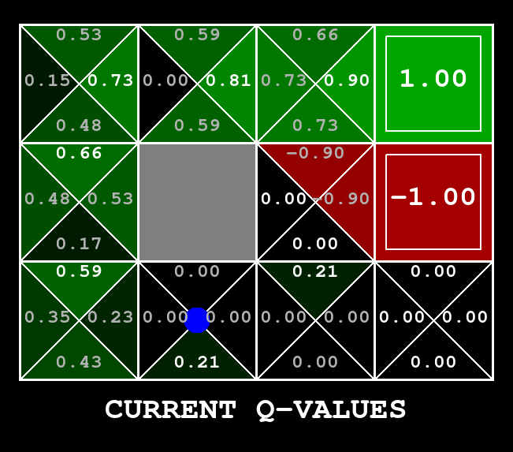

# Practical work / Travaux pratiques : Gridworld RL
This project implements a simple yet rich and variable gridworld environment for reinforcement learning, as well as tabular agents such as Q-learning and SARSA. 

<p align="center">
  
</p>

# The environnement

The environnement is a gridworld with a start and an end. The agent can move in 4 directions (up, down, left, right) and can only move on the grid. Its objective is to reach a positively rewarding end state.

Run this command to see a random agent moving in the gridworld:

    python run.py

What you see is the agent receiving a reward of +1 or -1 when it walks on the final states, which also terminate the episode.

### Grid maps
The map is defined by the argument --grid and implemented in the grid.py file. Grids available are book (default), bridge, maze, cliff, cliff2.

| Square state      | Effect            | Symbol in grid.py |
| -----------       | -----------       | ----------- | 
| Start             | Starting point    |'S' |
| Wall              | Can't go          | '#'|
| Free space        |                   | ' '|
| End bonus         | End episode and give positive reward           |n (with n an integer)  |
| End malus         | End episode and give negative reward              |-n  |


Additional relevant environnement parameters:
 - --livingReward : additional dense reward given at each step (default: 0)
 - --noise : probability of moving in a random direction (default: 0). This is different that the epsilon parameter (which is related to the agent, not the environnement).
 - --speed : speed of the animation (default 1), in ]0, +inf[.

You can check every parameter with the --help argument :

    python run.py --help


### Observations/States
The environnement is fully observable (one state = one observation). An observation or a state is simply a tuple (x,y) representing the position of the agent on the grid.

### Actions

The set of actions A are usually 4 actions ('up', 'down', 'left', 'right') but can be different and depend on the state : action set = A(s). 

You can access the set of available actions inside an Agent subclass with self.get_possible_actions(state).

### Rewards
The reward is a sparse reward given when the agent step on an end state. It can be negative (punishment) or positive (reward).

A dense reward is also possibly given when the livingReward argument is set to a value different from 0. Depending on its value, the agent may want to stay alive as long as possible or end the episode on a rewarding end state, or even finish episode as fast as possible (suicide).


# Create your own agents

For creating an agent (e.g. a random agent), you must:

- Create a class that inherits from `Agent` (in tp/agent.py), e.g. `RandomAgent`

- Implement the methods act(), observe() and learn() (see the docstrings for more information)

- Add this class and the agent name (e.g. "random") to the dictionary in tp/implemented_agents.py

- In case your agent is Value Based, you may inherit from `ValueBasedAgent` and implement the method `getQValue()` for a visual of your Q Values during training.

You can then train your agent with :
    
```bash
python run.py --agent <your_agent_name>
```

And you can change default parameters by following the help command. For example if you want to speed up by 5 the animation, you can run 
 
```bash
python run.py --agent <your_agent_name> --speed 5
```

# Implementation advice

- Define the hyperparameters (epsilon, gamma...) in the init() method

- Don't forget the exploration in the act() method

- You should store the Q values as a dictionary or a dictionnary of dictionary (with state and actions being keys)

- You can access the actions available at state 'state' with the method self.get_possible_actions(state) inside an Agent subclass.

- The method self.getQValues(state, action) should return a scalar

# Attribution Information: 

Attribution Information: The code used is partially extracted and adapted from the Pacman AI projects.
The Pacman AI projects were developed at UC Berkeley for the CS188 Intro to AI course.
Link to the original Berkeley course and Pacman Projects: http://ai.berkeley.edu.
